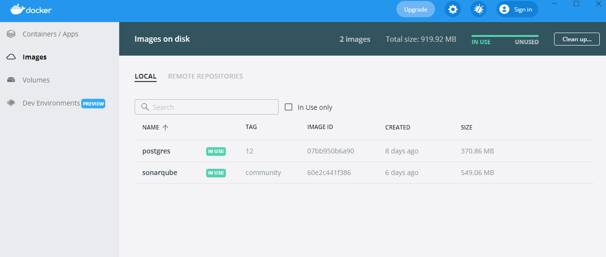

# SonarQube con Docker

Este es un ejemplo como prepara un servidor local de SonarQube en Windows con Docker Desktop

## Requisitos

- SO Windows 10
- [Docker Desktop](https://www.docker.com/products/docker-desktop)
- [Subsistema de Windows para Linux](https://docs.microsoft.com/es-es/windows/wsl/install-manual) la version 2 (Requerido por Docker)

Al terminar de instalar tanto Docker Desktop como WSL 2, se siguiere agregar un archivo `.wslconfig` para configurar la cantidad de RAM y de CPU's máxima que utilizara docker con WSL.

Un ejemplo del contenido del archivo `.wslconfig`

```
[wsl2]
memory=4GB   # Limits VM memory in WSL 2 up to 3GB
processors=2 # Makes the WSL 2 VM use two virtual processors
```

__Nota:__ *Para que :whale: pueda trabajar sin problemas, les pedira que configuren wls con un minimo de 4GB de Ram y 2 CPU's*

Este archivo debe estar ubicado en la carpeta de los datos del usuario `%USERPROFILE%` (este comando pueden pegarlo en el explorardor de windows)


## Cómo ejecutarlo

Para empezar haremos uso del archivo [sonar.yml](resources/sonar.yml) que la web de SonarQube nos brinda. En este archivo es un archivo de docker-compose en donde tenemos configurado el servidor de SonarQube Community con el puerto 9000 y la version 12 de Postgres.

`1.` Ubicaremos el archivo `sonar.yml` en un lugar seguro (porque despues no lo podemos mover de ahí) y luego abriremos el cmd y ejecutaremos el siguiente comando:

```
docker-compose -f sonar.yml up -d
```

*En mi caso yo lo deje en la raiz del disco D, pueden poner la ruta que deseen utlizando el caracter / para separar las carpetas*


Y aquí comenzara el proceso de descarga de las imagenes que vamos a utilizar para levantar el servidor local (sírvase un :coffee: y espere a que se complete la descarga)

`2.` Al concluir la descarga podemos verificar dentro de nuestro Docker Desktop que tenemos las imagenes de postgres y sonarque habilitatadas y en uso



Asi como tambien podemos verificar que los volumenes necesarios para persistir la data estan creados


Pero, al verficiar los contenedores, vemos que hay un problema y que el contenedor de sonar está detenido.


Esto se debe a los requisitos de SonarQube como Host, lo que dice en la página oficial de la [imagen de docker](https://hub.docker.com/_/sonarqube) es lo siguiente: 

>*Dado que SonarQube utiliza un Elasticsearch integrado, asegúrese de que la configuración del host de Docker cumpla con los requisitos del modo de producción de Elasticsearch y la configuración de los descriptores de archivos.*

`3.` Para solucionar el error anterior vamos a ingresar los siguientes comandos en la cmd de windows para que Docker Desktop con WSL pueda configurarse como un entorno de producción:

```
wsl -d docker-desktop sysctl -w vm.max_map_count=524288
wsl -d docker-desktop sysctl -w fs.file-max=131072
wsl -d docker-desktop ulimit -n 131072
wsl -d docker-desktop ulimit -u 8192
```
__Importante:__ *Estos comandos se deben ingresar cada vez que se inicie docker desktop, debido a que la configuracion se pierde al reiniciar la computadora o servidor* 

`4.` Ahora se debe reinicar Docker Desktop para que se reflejen los cambios y se pueda habilitar el uso de las imagenes de sonarqube:


Y listo!!! tenemos nuestro SonarQube Local :tada:


El manejo de Sonar y sus scanners sera en otro capítulo :wave:. 
